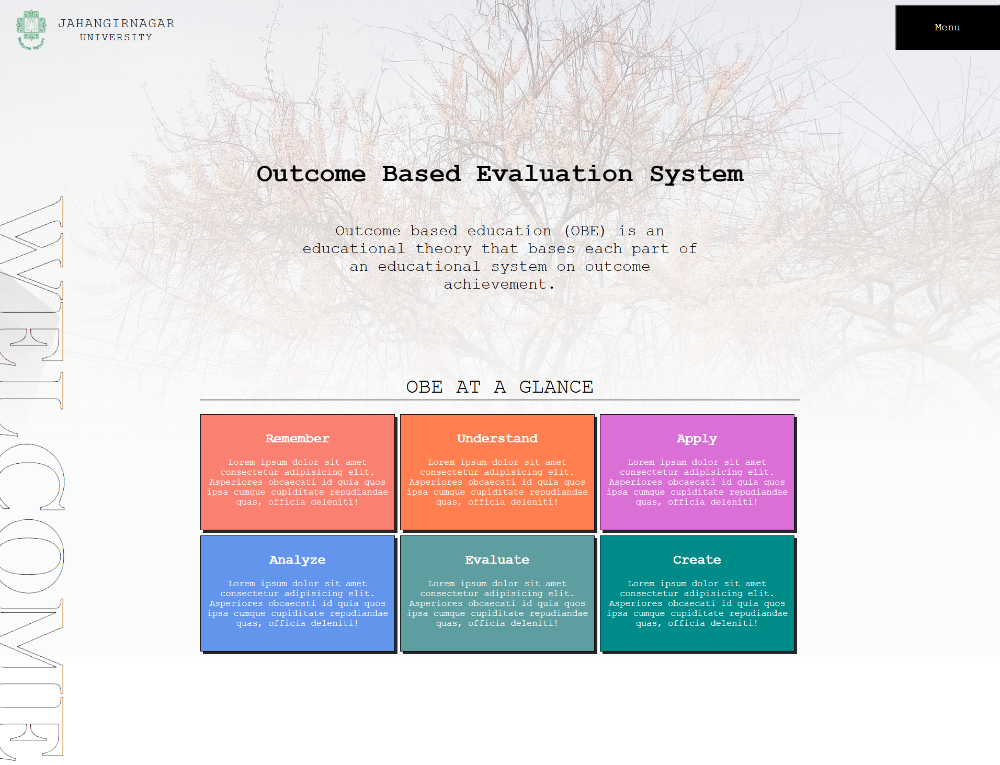
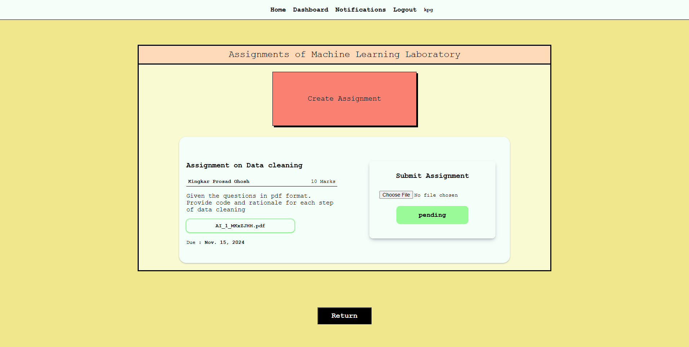
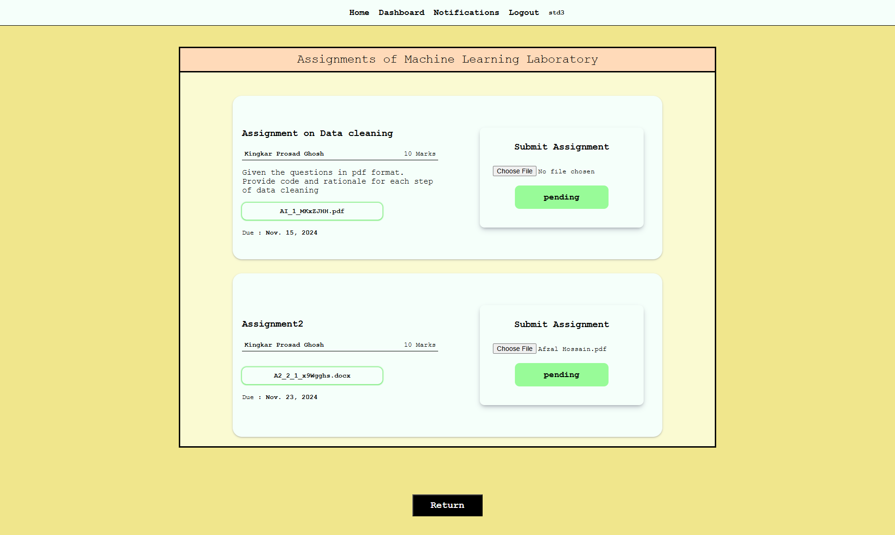
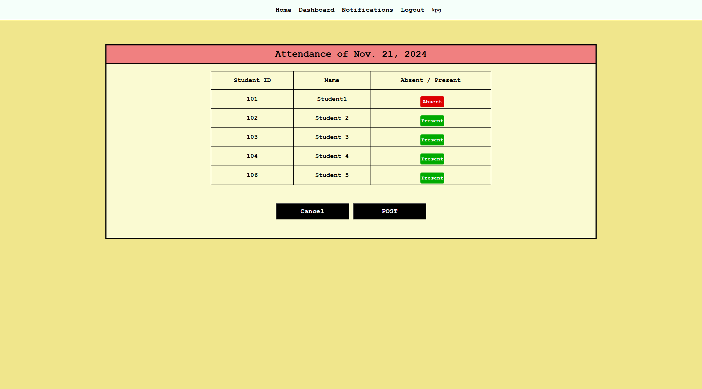
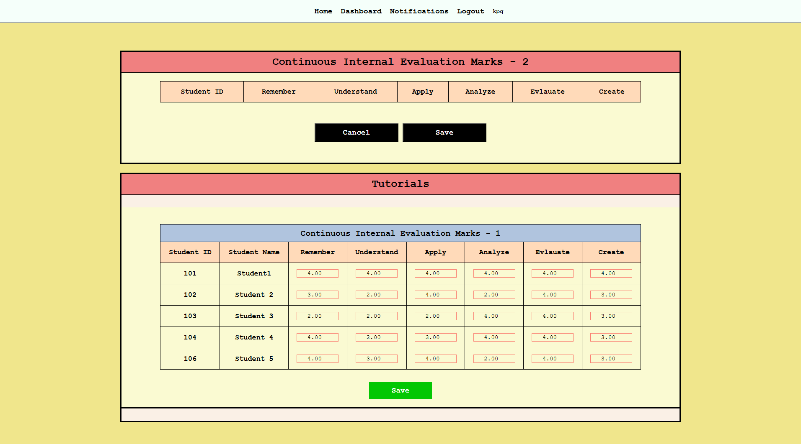
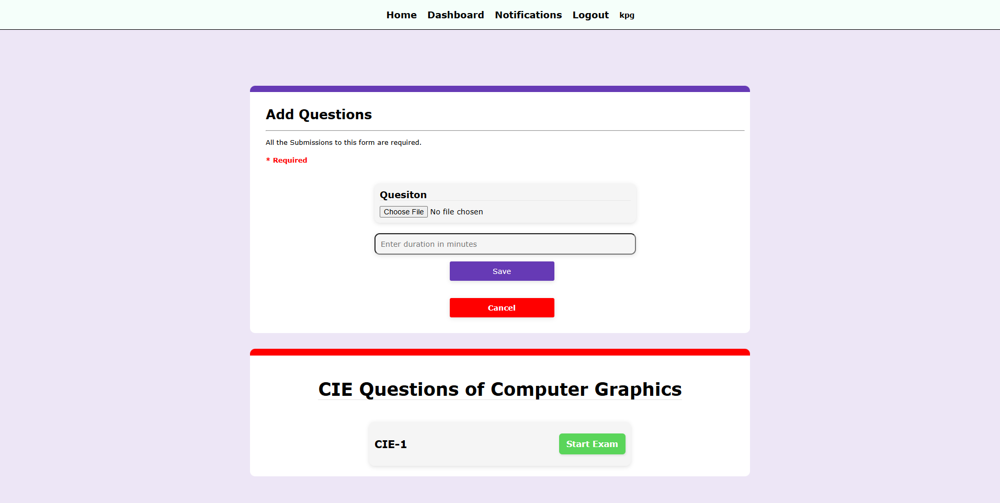
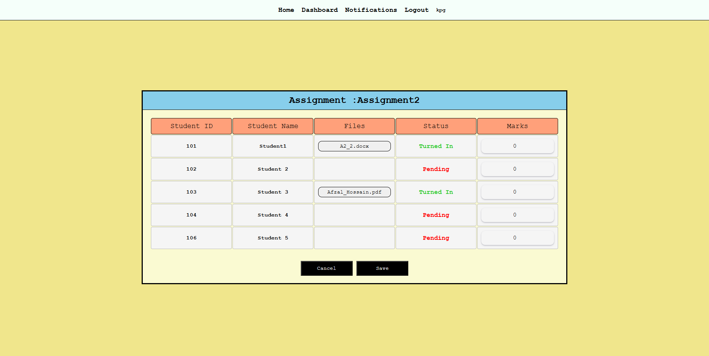
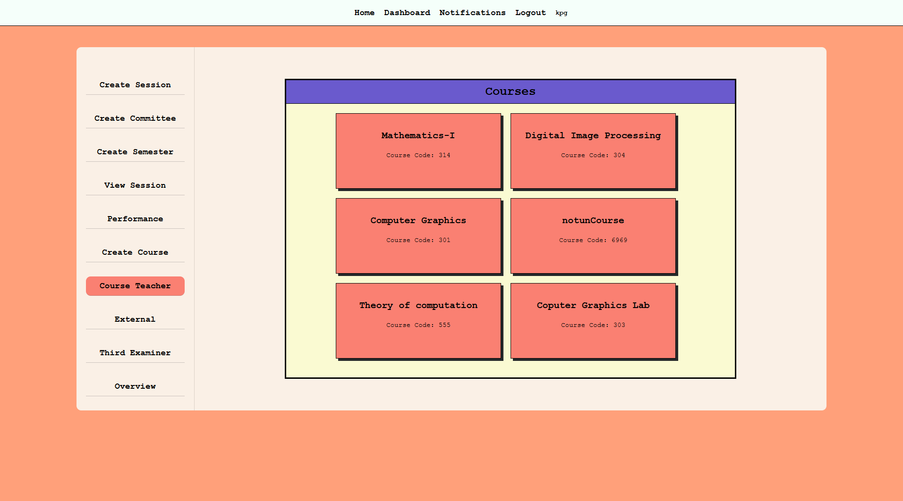

# Outcome Based Education System

Outcome Based Education System automates the overall process of evaluating the performance of both students and faculty. It is built using Django, Python, HTML, and CSS.

## Screenshots 
<p float="left">
  
   
  
     
   
   
   
     
</p>

## Features

- Automates evaluation of student and faculty performance.
- Teachers can conduct virtual exams.
- Teachers can post assignments.
- Answer sheets are automatically attached to the relevant sections for evaluation.
- A teacher can analyze his/her performance on a respective OBE section.
- Analysis of a result will be automatically avaialable after the result is published.


## Installation

1. **Clone the repository:**

    ```bash
    git clone https://github.com/afzallafza/Outcome-Based-Education-System.git
    cd Outcome-Based-Education-System
    ```

2. **Create a virtual environment and activate it:**

    ```bash
    python3 -m venv env
    source env/bin/activate  # On Windows use `env\Scripts\activate`
    ```

3. **Install the required dependencies:**

    ```bash
    pip install -r requirements.txt
    ```

4. **Apply migrations:**

    ```bash
    python manage.py migrate
    ```

5. **Create a superuser to access the admin panel:**

    ```bash
    python manage.py createsuperuser
    ```

6. **Run the development server:**

    ```bash
    python manage.py runserver
    ```

7. **Access the application:**

    Open your web browser and go to `http://127.0.0.1:8000/`.

## Usage

1. **Admin Panel:**
    - Go to `http://127.0.0.1:8000/admin/` to manage users, assignments, exams, and evaluations.

2. **Teacher:**
    - Log in and navigate to the dashboard to post assignments and conduct virtual exams.
    - Evaluate student submissions directly within the system.

3. **Student:**
    - Log in to view and submit assignments.
    - Participate in virtual exams.

## Contributing

We welcome contributions! Please follow these steps to contribute:

1. Fork the repository.
2. Create a new branch (`git checkout -b feature/your-feature-name`).
3. Make your changes.
4. Commit your changes (`git commit -m 'Add some feature'`).
5. Push to the branch (`git push origin feature/your-feature-name`).
6. Open a pull request.

## License

This project is licensed under the MIT License. See the [LICENSE](LICENSE) file for more details.

## Contact

For any inquiries or feedback, please contact:

- **Afzal Hossain Babor**
- **Email: afzallafza@gmail.com**
